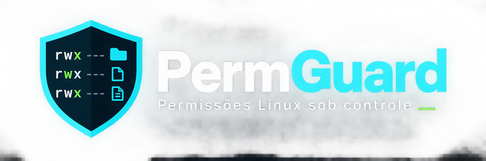
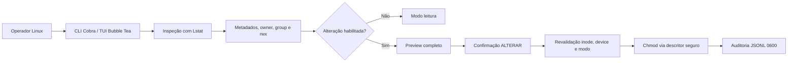
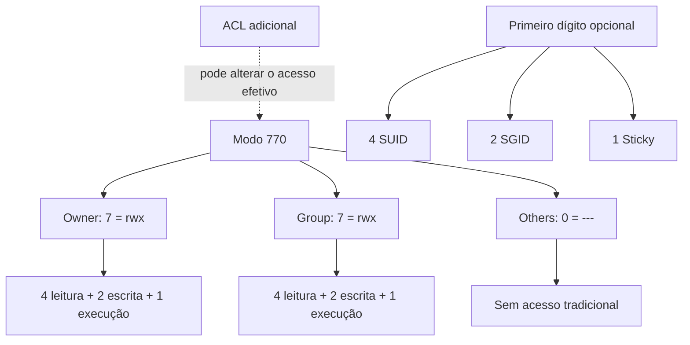

<p align="center">
  
</p>

# PermGuard

**PermGuard — inspeção e administração segura de permissões Linux.**

> Entender antes de alterar. Visualizar antes de aplicar. Confirmar antes de modificar. Auditar depois de executar.

PermGuard é uma TUI e CLI em Go para administradores Linux compreenderem permissões, ownership e riscos antes de qualquer mudança. Alterações individuais de modo são opt-in, sempre exibem preview, exigem a confirmação digitada `ALTERAR`, revalidam o alvo e geram auditoria local.

## Aviso de segurança

- Links simbólicos são inspecionados com `Lstat` e nunca seguidos para escrita.
- Alterações ficam bloqueadas sem `--permitir-alteracoes`.
- A ferramenta não solicita, recebe, registra ou armazena senha.
- Root não elimina preview, confirmação, revalidação ou auditoria.
- Listagens refletem o filesystem naquele instante e não são snapshots atômicos.

## Como o PermGuard funciona



### Modelo de permissões Linux



## Estado atual

Implementado:

- CLI com Cobra e TUI com Bubble Tea/Lip Gloss.
- Interface pt-BR e catálogo preparado para internacionalização.
- Configuração YAML e `PERMGUARD_LANG=pt-BR`.
- UID/EUID/GID/EGID, usuário, grupos e capabilities relevantes.
- Modo administrativo, privilegiado por capabilities ou somente leitura.
- Navegação local, caminho manual e filtro de itens carregados.
- Metadados, owner, grupo, inode, timestamps e estado read-only do mount.
- Arquivo, diretório, symlink, socket, FIFO e devices.
- Conversão e explicação de modos `000` a `7777`, incluindo SUID, SGID e sticky.
- Alteração individual de modo em arquivo ou diretório.
- Preview, confirmação digitada, revalidação anti-TOCTOU e auditoria JSONL `0600`.

Não implementado: chown, chgrp, relatórios, ACL/SELinux/capabilities mutáveis e recursão. Consulte [o roadmap](docs/roadmap.md).

## Requisitos

- Linux.
- Go 1.24 ou superior para desenvolvimento (requisito do Bubble Tea 1.3.10).
- Terminal ANSI; cores e Unicode pertencem ao tema do primeiro incremento.

Distribuições-alvo: RHEL, Rocky, AlmaLinux, CentOS Stream, Fedora, Debian, Ubuntu, Mint, Arch, Proxmox VE e outros hosts Linux.

## Instalação para desenvolvimento

Fedora/RHEL/Alma/Rocky:

```bash
sudo dnf install golang git
git clone https://github.com/gustavoohrodrigues/permguard.git
cd permguard
make build
./bin/permguard
```

Debian/Ubuntu/Mint/Proxmox:

```bash
sudo apt update
sudo apt install golang-go git make
git clone https://github.com/gustavoohrodrigues/permguard.git
cd permguard
make build
./bin/permguard
```

## Modo leitura e modo root

Modo leitura normal:

```bash
permguard
permguard inspecionar /srv/app
```

Inspeção com acesso administrativo concedido pelo próprio `sudo`:

```bash
sudo permguard
```

PermGuard nunca apresenta um campo de senha. O `sudo` autentica antes de iniciar o processo.

## CLI

```bash
permguard
permguard --lang pt-BR
permguard --config ./configs/permguard.example.yaml
permguard inspecionar /srv/app/uploads
permguard permissao explicar 770
permguard --permitir-alteracoes alterar-permissao /srv/app/uploads --modo 770
permguard --permitir-alteracoes alterar-permissao /srv/app/uploads --modo 770 --confirmar ALTERAR
```

Exemplo de explicação:

```text
Numérica: 770
Simbólica: -rwxrwx---

Proprietário (rwx): leitura, escrita e execução permitidas.
Grupo (rwx): leitura, escrita e execução permitidas.
Outros usuários (---): sem acesso.
```

## Navegação da TUI

| Tecla | Ação |
|---|---|
| `1` | Visão geral e privilégio |
| `2` | Navegador |
| `3` ou `p` | Detalhes do item |
| `4` | Explicação das permissões |
| `Enter` | Abrir diretório ou detalhes |
| `Backspace` | Diretório pai |
| `g` | Informar caminho |
| `/` | Filtrar itens carregados |
| `c` | Limpar filtro |
| `r` | Atualizar |
| `m` | Informar uma nova permissão para o item selecionado |
| `?` | Ajuda |
| `q` | Sair |

## chmod, chown, chgrp e ACL

- `chmod`: altera leitura, escrita, execução e bits especiais.
- `chown`: altera proprietário e, opcionalmente, grupo.
- `chgrp`: altera somente o grupo proprietário.
- ACL: pode conceder acesso além de owner/group/others; edição fica fora do MVP.

O estado atual implementa somente `chmod` individual. `chown`, `chgrp` e edição de ACL continuam indisponíveis.

## Alterar uma permissão pela TUI

```bash
permguard --permitir-alteracoes
```

1. Navegue até o arquivo ou diretório.
2. Selecione o item e pressione `m`.
3. Informe um modo como `755`, `770`, `640` ou `1777`.
4. Revise o caminho, tipo, modo atual e modo proposto.
5. Pressione `Enter` e digite exatamente `ALTERAR`.

Symlinks, devices, sockets, `/`, `/proc`, `/sys`, `/dev` e `/run` são bloqueados. Não há recursão nem repetição automática.

## Pesquisa e inclusão de caminhos

- `/` abre a pesquisa rápida nos itens já carregados.
- `c` limpa a pesquisa.
- `g` abre a entrada direta de caminho absoluto ou relativo.
- `Enter` entra no diretório selecionado ou abre os detalhes.

Esses fluxos não varrem toda a árvore e não seguem symlinks automaticamente.

## Auditoria

- Usuário normal: `~/.local/state/permguard/audit.jsonl`.
- Root: `/var/log/permguard/audit.jsonl`.
- Permissão forçada: `0600`.
- Registra metadados da operação, nunca conteúdo ou senha.

## Permissões numéricas

| Valor | Bits | Significado |
|---:|:---:|---|
| 0 | `---` | nenhum acesso |
| 1 | `--x` | executar/atravessar |
| 2 | `-w-` | escrever |
| 3 | `-wx` | escrever e executar |
| 4 | `r--` | ler |
| 5 | `r-x` | ler e executar |
| 6 | `rw-` | ler e escrever |
| 7 | `rwx` | ler, escrever e executar |

Exemplos: `755` compartilhamento somente para leitura/execução por grupo e outros; `770` acesso total de owner e grupo; `775` escrita para owner/grupo; `644` arquivo público para leitura; `640` leitura do grupo; `600` privado ao owner; `1777` diretório compartilhado com sticky bit.

O primeiro dígito especial pode combinar `4` (SUID), `2` (SGID) e `1` (sticky). Consulte [permissões](docs/permissoes.md).

## Configuração e idioma

```bash
mkdir -p "${XDG_CONFIG_HOME:-$HOME/.config}/permguard"
cp configs/permguard.example.yaml "${XDG_CONFIG_HOME:-$HOME/.config}/permguard/config.yaml"
PERMGUARD_LANG=pt-BR permguard
```

Ordem: `--lang`, `PERMGUARD_LANG`, YAML e, por fim, `pt-BR`.

## Testes

```bash
make test
make race
make vet
make lint
make build
```

Todos os testes de filesystem usam diretórios temporários próprios. Nenhum teste deve tocar em arquivos reais do host.

## Documentação

- [Arquitetura](docs/arquitetura.md)
- [Segurança](docs/seguranca.md)
- [Permissões](docs/permissoes.md)
- [Ownership](docs/ownership.md)
- [Auditoria](docs/auditoria.md)
- [Atalhos](docs/atalhos.md)
- [Roadmap](docs/roadmap.md)

## Licença

MIT. Consulte [LICENSE](LICENSE).
